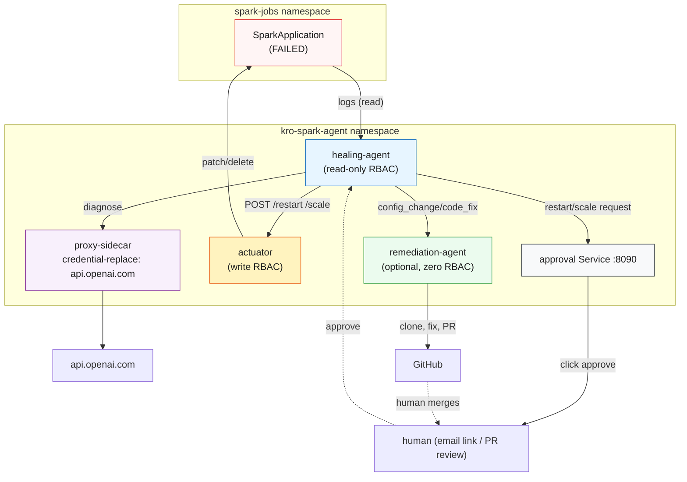

# kro-spark-agent — Self-Healing Spark Jobs as One KRO Custom Resource

Ports an existing standalone prototype (`spark_healing_agent.py`, an OpenAI-driven
watcher for failing `SparkApplication` CRs) onto the patterns from this repo's
concepts: a KRO `ResourceGraphDefinition` (concept 06) that generates the whole
system from one CR, and the transparent credential proxy (concept 03/`proxy/`)
for the agent's one external API call.

## Concept Summary

A `SparkApplication` fails. A **healing agent** (read-only Kubernetes RBAC) notices,
pulls the driver logs, and asks an LLM to diagnose it. If the fix is a restart or an
executor-count bump, it emails a human an approve/reject link — clicking it is the
only way the action actually happens. If the fix looks like a code or config bug, it
hands the diagnosis to an optional **remediation agent**, which uses the Claude
Agent SDK to patch the job's repo and open a PR; a human merging that PR is the
approval gate for that path. Neither the healing agent nor the remediation agent can
mutate a `SparkApplication` directly — only a third component, the **actuator**, holds
that RBAC, and only the healing agent's pod may reach it (`NetworkPolicy`).

All of this — RBAC, Deployments, Services, NetworkPolicies, the proxy allowlist — is
generated from a single `SparkHealingAgent` custom resource.



## Design Decisions (and why)

| Original prototype | This port | Why |
|---|---|---|
| Hand-written Deployments, RBAC, NetworkPolicy, Secrets (10+ YAML files) | One `SparkHealingAgent` CR, expanded by a KRO `ResourceGraphDefinition` | Same "one CRD to rule them all" idea as concept 06 |
| `kubernetes-mcp-server` (generic third-party MCP image) holds write RBAC | First-party `actuator/` FastAPI service holds write RBAC | Same least-privilege split (diagnose vs. act), no external image/protocol dependency — mirrors this repo's own small first-party services (`proxy/`, `remediation-agent/`) |
| Diagnosis LLM: OpenAI `gpt-4o` | Unchanged — still OpenAI | Kept by design; only the Kubernetes/KRO shape changed, not the model backend |
| Real `OPENAI_API_KEY` in the healing-agent container | `proxy/` sidecar injects it; container only ever sees `FAKE_KEY_REPLACED_BY_PROXY` | Reuses concept 03's transparent credential proxy instead of trusting the app container with the real key |
| SMTP creds, actuator calls, Kubernetes API calls | Left un-intercepted (`proxy.mode: allow-everything`, only `api.openai.com` is credential-replaced) | The proxy can only match a hostname via TLS SNI or an HTTP Host header — SMTP (STARTTLS), the in-cluster actuator Service, and the in-cluster Kubernetes API don't present one the same way an external HTTPS API does. `NetworkPolicy` + RBAC are the real boundary for those, not the proxy allowlist |
| `remediation-agent/` (Claude Agent SDK, opens PR) | Rewritten to use a first-party OpenAI tool-calling loop instead | Claude Agent SDK is Anthropic-only; keeping one LLM backend (OpenAI) across the whole system avoids depending on two separate provider accounts. Still `automountServiceAccountToken: false`, still zero cluster credentials, still deterministic git/PR mechanics outside the model |

Both the healing-agent container and the proxy sidecar mount the same `/certs` volume. The healer uses `NODE_EXTRA_CA_CERTS=/certs/proxy-ca.crt` and `SSL_CERT_FILE=/certs/combined-ca.crt`, while the proxy sidecar now uses `SSL_CERT_FILE=/certs/combined-ca.crt` too so its upstream TLS dial can verify `api.openai.com` through the same corporate root bundle.

## What KRO Generates

From one `SparkHealingAgent` instance, KRO creates (remediation resources only when `spec.remediation.enabled: true`):

| # | Resource | Purpose |
|---|----------|---------|
| 1 | ConfigMap (proxy allowlist) | `api.openai.com` credential-replace config for the healing agent's sidecar |
| 2-4 | ServiceAccount + Role + RoleBinding (`*-actuator`) | Write RBAC on `sparkapplications`, scoped to `sparkNamespace` only |
| 5-7 | ServiceAccount + Role + RoleBinding (`*-healer`) | Read-only RBAC (pods, pods/log, sparkapplications get/list/watch) |
| 8-9 | Deployment + Service (actuator) | The only component that can patch/delete a `SparkApplication` |
| 10 | NetworkPolicy | Only the healing agent's pod may reach the actuator |
| 11 | Deployment (healing agent + proxy sidecar) | Watch loop, diagnosis, email approval server |
| 12 | Service (approval) | `:8090` — port-forward this to click approve/reject links |
| 13-16 | ConfigMap + Deployment + Service + NetworkPolicy (remediation) | Optional PR-opening agent |

## Prerequisites

- A Kubernetes cluster with [spark-operator](https://github.com/kubeflow/spark-operator) installed and watching `spark-jobs`
- [KRO](https://kro.run) installed:
  ```bash
  helm install kro oci://registry.k8s.io/kro/charts/kro --namespace kro-system --create-namespace
  kubectl wait --for=condition=Available deploy -n kro-system --all --timeout=60s
  ```
- An OpenAI API key, and a Gmail App Password for the approval-email flow ([myaccount.google.com/apppasswords](https://myaccount.google.com/apppasswords), needs 2FA)
- (Optional, only if `remediation.enabled: true`) an OpenAI API key (same account as the diagnosis call) and a fine-grained GitHub PAT scoped to `contents:write` + `pull_requests:write` on only the target Spark job repo(s)

## Step-by-Step

All commands run from the **project root**.

### 1. Build the images

```bash
docker build -t spark-healing-agent:latest kro-spark-agent/healing-agent/
docker build -t spark-actuator:latest kro-spark-agent/actuator/
docker build -t spark-remediation-agent:latest kro-spark-agent/remediation-agent/   # only if using remediation
kind load docker-image spark-healing-agent:latest spark-actuator:latest --name claude-demo
kind load docker-image spark-remediation-agent:latest --name claude-demo             # only if using remediation
```

### 2. Namespaces

```bash
kubectl apply -f kro-spark-agent/manifests/namespaces.yaml
```

### 3. Apply the ResourceGraphDefinition

```bash
kubectl apply -f kro-spark-agent/manifests/rgd.yaml
kubectl wait --for=condition=Ready rgd/sparkhealingagent --timeout=30s
kubectl get crd sparkhealingagents.kro.run
```

### 4. Secrets

```bash
cp kro-spark-agent/manifests/secrets.example.yaml /tmp/secrets.yaml
# edit /tmp/secrets.yaml with real values, then:
kubectl apply -f /tmp/secrets.yaml
```

### 5. Deploy the instance

Edit `approvalEmailTo` in `kro-spark-agent/manifests/instance.yaml`, then:

```bash
kubectl apply -f kro-spark-agent/manifests/instance.yaml
kubectl wait --for=condition=Ready sparkhealingagent/spark-healer -n kro-spark-agent --timeout=60s
```

### 6. Port-forward the approval service

```bash
kubectl port-forward svc/spark-healer-approval 8090:8090 -n kro-spark-agent
```

### 7. Trigger a failure

```bash
kubectl apply -f kro-spark-agent/manifests/test-jobs.yaml
```

Within one `pollIntervalSeconds` cycle, watch the healing agent's logs — it should diagnose
the failure and, for `test-failing-job`, email an approve/reject link to `approvalEmailTo`.

## How to Verify

```bash
# What KRO created
kubectl get deployment,service,networkpolicy -n kro-spark-agent -l app.kubernetes.io/managed-by=kro

# Healing agent logs (diagnosis + proposed actions)
kubectl logs -f deploy/spark-healer-healer -c healing-agent -n kro-spark-agent

# Proxy logs (only api.openai.com should be credential-replaced)
kubectl logs deploy/spark-healer-healer -c proxy-sidecar -n kro-spark-agent

# Confirm the healing agent itself cannot mutate SparkApplications
kubectl auth can-i delete sparkapplications \
  --as=system:serviceaccount:kro-spark-agent:spark-healer-healer -n spark-jobs   # expect "no"
kubectl auth can-i delete sparkapplications \
  --as=system:serviceaccount:kro-spark-agent:spark-healer-actuator -n spark-jobs # expect "yes"

# Actuator logs (only visible when an approval link is clicked)
kubectl logs deploy/spark-healer-actuator -n kro-spark-agent
```

## Expected Output

```
# kubectl get sparkhealingagent -n kro-spark-agent
NAME            AGE
spark-healer    30s

# kubectl get deployment -n kro-spark-agent
NAME                     READY   UP-TO-DATE   AVAILABLE   AGE
spark-healer-actuator    1/1     1            1           30s
spark-healer-healer      1/1     1            1           30s

# healing-agent logs, after test-failing-job fails
=== Proposed Action for test-failing-job ===
{
  "summary": "mainClass org.example.DoesNotExist not found in jar",
  "root_cause": "SparkApplication spec references a nonexistent mainClass",
  "recommended_action": "restart"
}
Approval email sent to you@example.com for test-failing-job
```

## Cleanup

```bash
kubectl delete -f kro-spark-agent/manifests/test-jobs.yaml
kubectl delete sparkhealingagent spark-healer -n kro-spark-agent   # KRO garbage-collects all child resources
kubectl delete -f kro-spark-agent/manifests/rgd.yaml
kubectl delete -f kro-spark-agent/manifests/namespaces.yaml
```

## Source

Ported from a standalone prototype at `~/spark-agent` (healing agent + MCP-based
actuator + remediation agent, plain YAML manifests, Docker Desktop Kubernetes).
The `remediation-agent/` code is carried over essentially unchanged; see its own
README for the PR-opening flow and its security posture.
