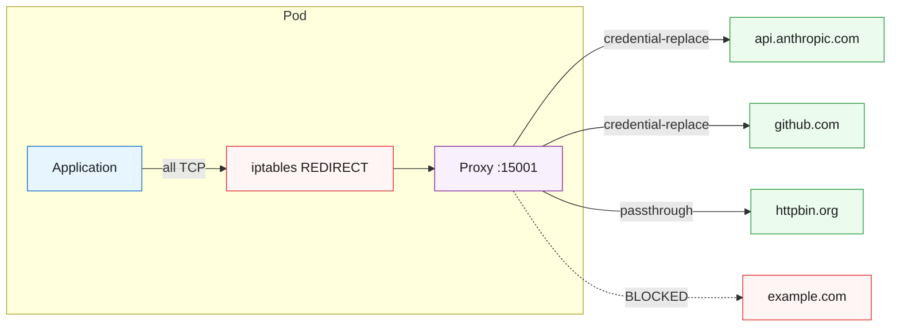

# Transparent Credential Proxy

A Go-based transparent proxy that intercepts outbound connections via iptables and injects real credentials into requests. The main application container never sees real credentials — only placeholder values.



## How It Works

The proxy runs as a Kubernetes sidecar alongside iptables init containers:

1. **iptables-init** — redirects all outbound TCP to the proxy port (default 15001), excluding the proxy's own traffic (UID 1337)
2. **cert-init** — generates an ephemeral CA certificate for TLS interception
3. **proxy-sidecar** — accepts redirected connections, identifies the destination via TLS SNI or HTTP Host header, and either:
   - **credential-replace** — terminates TLS, replaces placeholder credentials with real ones, forwards to upstream
   - **passthrough** — tunnels bytes without inspection
   - **blocks** — closes the connection and logs it

## Operating Modes

If your environment uses a corporate TLS-inspection CA, the proxy image itself must trust that CA as well. This repo bakes `zscaler-root.crt` into the image's system CA store, and the proxy-sidecar also reads the mounted `/certs/combined-ca.crt` via `SSL_CERT_FILE` for upstream verification.

| Mode | Listed domains | Detected but unlisted | Undetectable (SSH, SQL) |
|------|---------------|----------------------|------------------------|
| **strict** (default) | credential-replace / passthrough | BLOCKED | BLOCKED |
| **allow-everything** | credential-replace / passthrough | PASSTHROUGH | PASSTHROUGH |
| **block-unknown** | credential-replace / passthrough | PASSTHROUGH | BLOCKED |

The proxy can only detect hostnames in **HTTP** (Host header) and **TLS** (SNI in ClientHello) protocols. Raw TCP protocols (SSH, PostgreSQL, Redis) are undetectable — use `allow-everything` mode with Kubernetes NetworkPolicy for those.

## Configuration

The proxy reads a YAML config from `/etc/proxy/config.yaml` (mounted via ConfigMap):

```yaml
# mode: strict  (default — omit for strict)

domains:
  # Credential replacement (defaults: port=443, action=credential-replace)
  - host: api.anthropic.com
    inject_header: x-api-key
    credential_env: ANTHROPIC_API_KEY

  - host: github.com
    inject_auth: basic
    credential_env: GH_TOKEN

  # Passthrough (no credential injection)
  - host: registry.npmjs.org
    action: passthrough

  # Non-standard port
  - host: internal-api.example.com
    port: 8443
    inject_header: authorization
    credential_env: INTERNAL_TOKEN
```

### Domain Entry Fields

| Field | Default | Description |
|-------|---------|-------------|
| `host` | (required) | Hostname to match |
| `port` | `443` | Port to match |
| `action` | `credential-replace` | `credential-replace` or `passthrough` |
| `inject_header` | | HTTP header name to set (e.g., `x-api-key`) |
| `inject_auth` | | Auth type: `basic` (sets Authorization header) |
| `credential_env` | | Env var containing the real credential value |

## Environment Variables

| Variable | Default | Used by | Description |
|----------|---------|---------|-------------|
| `PROXY_PORT` | `15001` | proxy-sidecar, iptables-init | Port the proxy listens on |
| `PROXY_UID` | `1337` | iptables-init | UID excluded from iptables redirect (must match `runAsUser`) |
| `CERT_VALIDITY_DAYS` | `365` | cert-init | CA certificate validity in days |
| `PROXY_CONFIG` | `/etc/proxy/config.yaml` | proxy-sidecar | Path to config file |
| `CERT_DIR` | `/certs` | proxy-sidecar | Path to CA key/cert directory |

## Build

```bash
make build-proxy

# If Docker can't reach proxy.golang.org:
make build-proxy GOPROXY=direct
```

Or manually:

```bash
docker build -t credential-proxy:latest proxy/
```

## Deployment Pattern

Each pod that uses the proxy needs three init containers and the proxy-config ConfigMap:

```yaml
volumes:
  - name: proxy-certs
    emptyDir: {}
  - name: proxy-config
    configMap:
      name: proxy-config

initContainers:
  # NOTE: PROXY_PORT must match the proxy-sidecar containerPort
  - name: iptables-init
    image: credential-proxy:latest
    command: ["/bin/bash", "/app/iptables-init.sh"]
    securityContext:
      capabilities:
        add: ["NET_ADMIN"]
      runAsUser: 0
    env:
      - name: PROXY_PORT
        value: "15001"
      # Must match proxy-sidecar runAsUser
      - name: PROXY_UID
        value: "1337"

  - name: cert-init
    image: credential-proxy:latest
    command: ["/bin/bash", "/app/cert-init.sh"]
    securityContext:
      runAsUser: 0
    volumeMounts:
      - name: proxy-certs
        mountPath: /certs

  - name: proxy-sidecar
    image: credential-proxy:latest
    restartPolicy: Always
    securityContext:
      runAsUser: 1337
    env:
      - name: PROXY_PORT
        value: "15001"
      - name: SSL_CERT_FILE
        value: "/certs/combined-ca.crt"
      - name: ANTHROPIC_API_KEY
        valueFrom:
          secretKeyRef:
            name: agent-credentials
            key: ANTHROPIC_API_KEY
    volumeMounts:
      - name: proxy-certs
        mountPath: /certs
      - name: proxy-config
        mountPath: /etc/proxy
    ports:
      - containerPort: 15001

containers:
  - name: app
    env:
      - name: ANTHROPIC_API_KEY
        value: "FAKE_KEY_REPLACED_BY_PROXY"
      - name: NODE_EXTRA_CA_CERTS
        value: "/certs/proxy-ca.crt"
      - name: SSL_CERT_FILE
        value: "/certs/combined-ca.crt"
    volumeMounts:
      - name: proxy-certs
        mountPath: /certs
        readOnly: true
```
